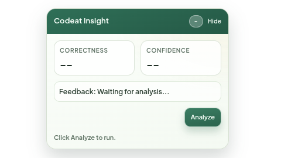
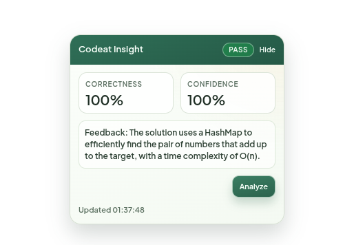
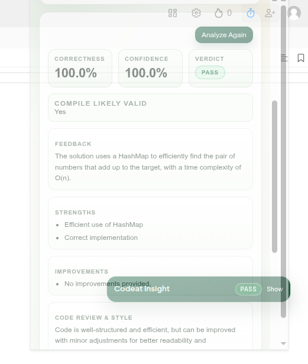

cool# Codeat  (Multi-language DSA LLM Evaluator)

API service to evaluate DSA submissions across multiple languages (C++, Java, Python, JavaScript, Go, C#, and similar) using an LLM and return:
- matched problem guess
- accuracy and confidence percentages
- LeetCode-likely verdict (`PASS`, `MAY_PASS`, `FAIL`, `UNCERTAIN`)
- structured failing scenarios (when applicable)
- conditional code review + style analysis for predicted `100% PASS` solutions

## Tech Stack
- Java 17
- Spring Boot 4
- Maven

## Run Locally

```bash
./mvnw spring-boot:run
```

Service runs on port `3502` (see `src/main/resources/application.yml`).

## Environment Variables

Start from the example file and create your local env config:

```bash
cp env.example env.txt
```

```bash
# Primary LLM Provider: openai | groq | openrouter | cerebras
export LLM_PROVIDER=groq

# API Keys (use one based on your provider)
export GROQ_API_KEY=your_groq_key
# or
export LLM_API_KEY=your_openai_key
# or
export CEREBRAS_API_KEY=your_cerebras_key
# or
export OPENROUTER_API_KEY=your_openrouter_key

# Model Configuration
export LLM_MODEL=llama-3.3-70b-versatile
export LLM_API_URL= # optional override; provider defaults are auto-resolved

# Rate Limiting (prevents hitting API limits)
export LLM_REQUEST_DELAY_MS=3000  # 3 second delay between requests (default: 3000)

# Fallback Configuration (optional, disabled by default for dev)
export LLM_FALLBACK_ENABLED=false  # set to true to enable fallback
export LLM_FALLBACK_PROVIDER=openrouter  # openai | groq | openrouter | cerebras
export LLM_FALLBACK_API_KEY=${OPENROUTER_API_KEY}  # only needed if fallback enabled
export LLM_FALLBACK_MODEL=meta-llama/llama-3.2-3b-instruct  # cheap pay-per-use
# export LLM_FALLBACK_API_URL= # optional override
```

Provider defaults:
- `openai` -> `https://api.openai.com/v1/chat/completions`
- `groq` -> `https://api.groq.com/openai/v1/chat/completions`
- `openrouter` -> `https://openrouter.ai/api/v1/chat/completions`
- `cerebras` -> `https://api.cerebras.ai/v1/chat/completions`

### Provider Comparison

| Provider | Free Tier | Speed | Rate Limits | Best For |
|----------|-----------|-------|-------------|----------|
| **Groq** | ✅ Yes | ⚡ Very Fast | 30 req/min | Development |
| **Cerebras** | ✅ Yes (generous) | ⚡⚡ Ultra Fast | High limits | Production |
| **OpenRouter** | ⚠️ Limited free | 🐢 Slow | Varies by model | Testing multiple models |
| **OpenAI** | ❌ Paid only | 🔥 Fast | High (paid) | Production |

### Fallback Mechanism

When the primary LLM hits rate limit (HTTP 429), the service automatically switches to the fallback provider if configured. This ensures uninterrupted analysis even during high usage periods.

**Recommended Fallback Setup:**
- **Primary:** Groq (fast, free)
- **Fallback:** Cerebras (generous free tier, ultra-fast)

**Setup Examples:**

**1. Groq (Recommended for development):**
```bash
export LLM_PROVIDER=groq
export GROQ_API_KEY=your_groq_key
export LLM_MODEL=llama-3.3-70b-versatile
export LLM_REQUEST_DELAY_MS=3000
export LLM_FALLBACK_ENABLED=false
```

**2. Cerebras (Fast inference, generous free tier):**
```bash
export LLM_PROVIDER=cerebras
export CEREBRAS_API_KEY=your_cerebras_key
export LLM_MODEL=llama-3.3-70b
export LLM_REQUEST_DELAY_MS=2000
export LLM_FALLBACK_ENABLED=false
```

**3. OpenRouter (Pay-per-use, many models):**
```bash
export LLM_PROVIDER=openrouter
export OPENROUTER_API_KEY=your_openrouter_key
export LLM_MODEL=meta-llama/llama-3.3-70b-instruct
export LLM_REQUEST_DELAY_MS=2000
export LLM_FALLBACK_ENABLED=false
```

**4. OpenAI (Paid, highest quality):**
```bash
export LLM_PROVIDER=openai
export LLM_API_KEY=your_openai_key
export LLM_MODEL=gpt-4o-mini
export LLM_REQUEST_DELAY_MS=1000
export LLM_FALLBACK_ENABLED=false
```

### Quick Provider Switch

To switch providers, just change these 3 environment variables:

```bash
# Switch to Cerebras
export LLM_PROVIDER=cerebras
export CEREBRAS_API_KEY=your_key
export LLM_MODEL=llama-3.3-70b

# Switch to Groq
export LLM_PROVIDER=groq
export GROQ_API_KEY=your_key
export LLM_MODEL=llama-3.3-70b-versatile

# Switch to OpenRouter
export LLM_PROVIDER=openrouter
export OPENROUTER_API_KEY=your_key
export LLM_MODEL=meta-llama/llama-3.3-70b-instruct
```

Then restart the backend:
```bash
./mvnw spring-boot:run
```

### Recommended Setup for Development

**Option 1: Single Provider (Simplest)**
```bash
export LLM_PROVIDER=groq
export GROQ_API_KEY=your_groq_key
export LLM_MODEL=llama-3.3-70b-versatile
export LLM_REQUEST_DELAY_MS=3000
export LLM_FALLBACK_ENABLED=false
```

**Option 2: With Cerebras Fallback (Fast & Generous Free Tier)**
```bash
export LLM_PROVIDER=groq
export GROQ_API_KEY=your_groq_key
export LLM_MODEL=llama-3.3-70b-versatile

export LLM_FALLBACK_ENABLED=true
export LLM_FALLBACK_PROVIDER=cerebras
export CEREBRAS_API_KEY=your_cerebras_key
export LLM_FALLBACK_MODEL=llama-3.3-70b
```

**Option 3: With OpenRouter Fallback (Pay-Per-Use)**
```bash
export LLM_PROVIDER=groq
export GROQ_API_KEY=your_groq_key

export LLM_FALLBACK_ENABLED=true
export LLM_FALLBACK_PROVIDER=openrouter
export OPENROUTER_API_KEY=your_openrouter_key

# These models are cheap (~$0.10 per 1M tokens)
export LLM_FALLBACK_MODEL=meta-llama/llama-3.2-3b-instruct      # Very cheap
# OR
export LLM_FALLBACK_MODEL=google/gemini-flash-1.5               # Fast & cheap
# OR
export LLM_FALLBACK_MODEL=qwen/qwen-2-7b-instruct               # Good quality
```

**Popular Cerebras Models:**
- `llama-3.3-70b` - Llama 3.3 70B (recommended, fastest)
- `llama3.1-8b` - Smaller, even faster
- `llama3.1-70b` - Alternative 70B model
- All models on Cerebras have generous free tier and ultra-fast inference!

### Rate Limiting Configuration

To avoid hitting rate limits, add a delay between requests:

```bash
# Recommended: 3 seconds between API calls
export LLM_REQUEST_DELAY_MS=3000

# Conservative: 5 seconds (almost never hits limits)
export LLM_REQUEST_DELAY_MS=5000

# Aggressive: 1 second (may hit limits on free tier)
export LLM_REQUEST_DELAY_MS=1000
```

### Tips to Avoid Rate Limits

1. **Don't spam Analyze** - Wait a few seconds between analyses
2. **Increase backend delay** - Set `LLM_REQUEST_DELAY_MS=3000` or higher
3. **Use one provider** - Disable fallback to simplify: `LLM_FALLBACK_ENABLED=false`
4. **Prefer stable models** - Reduce retries caused by malformed/empty outputs

**For Groq Free Tier Limits:**
- 30 requests/minute for llama-3.3-70b-versatile
- With 3 second delay, you'll do ~20 requests/minute = safe ✅
- Some analyses may use a second LLM call for `100% PASS` review/style output

## API Endpoints

### 1) List Problems
`GET /api/v1/problems`

Returns in-memory sample problems used as hints in MVP.

### 2) Analyze Submission
`POST /api/v1/analyze`

Request body:
```json
{
  "problemId": "1",
  "problemStatement": "optional",
  "className": "Solution",
  "sourceCode": "int maxArea(vector<int>& height) { ... }"
}
```

`problemId`, `problemStatement`, and `className` are optional hints.
`className` is mainly useful for class-based languages (for example Java/C#).
`sourceCode` is required.

Response shape:
```json
{
  "matchedProblemId": "1",
  "matchedProblemTitle": "Two Sum",
  "accuracyPercentage": 100.0,
  "confidencePercentage": 96.0,
  "leetcodeLikelyVerdict": "PASS",
  "estimatedPassedTestCases": 100,
  "estimatedTotalTestCases": 100,
  "compileLikelyValid": true,
  "feedback": "...",
  "strengths": ["..."],
  "improvements": ["..."],
  "failingScenarios": [
    {
      "inputExample": "...",
      "expectedBehavior": "...",
      "predictedBehavior": "...",
      "reason": "..."
    }
  ],
  "reviewSummary": "Maintainable structure with clear control flow.",
  "styleScorePercentage": 88.5,
  "styleFindings": ["Method naming is mostly consistent."],
  "reviewSuggestions": ["Extract duplicate branch logic into a helper."],
  "modelUsed": "llama-3.3-70b-versatile"
}
```

`reviewSummary`, `styleScorePercentage`, `styleFindings`, and `reviewSuggestions` are optional and are populated only for predicted `100% PASS` solutions.

## Verdict Meaning
- `PASS`: strong evidence code should pass hidden tests.
- `MAY_PASS`: high chance to pass, but not fully certain.
- `FAIL`: likely to fail hidden tests.
- `UNCERTAIN`: insufficient signal or conflicting signal.

## Notes on Scoring
- The service is LLM-first (no deterministic code execution engine in this MVP).
- The analyzer detects language from submitted code and aligns feedback to that language.
- A normalization layer is applied to reduce contradictory LLM outputs.
- Structured failing scenarios are filtered for low-quality/hallucinated entries.

## Tests

```bash
./mvnw test
```

## Chrome Extension (MVP)

A Chrome extension scaffold is available in `chrome-extension/`.

### Load in Chrome

1. Open `chrome://extensions`
2. Enable `Developer mode`
3. Click `Load unpacked`
4. Select the `chrome-extension` folder

### Configure

1. Open extension `Settings`
2. Set:
   - `API Base URL`: `http://localhost:3502`
   - `Analyze Path`: `/api/v1/analyze`

### Use

1. Open a coding page with visible source code.
2. Click `Analyze` in the popup or in-page widget to run analysis (manual trigger only).
3. Use `Extract From Tab` to auto-fill code/context before analyzing.
4. Review results in popup (accuracy, confidence, verdict, strengths, improvements, likely failing scenarios).
5. For predicted `100% PASS`, popup also shows `Code Review & Style`.
6. The in-page widget is draggable and can be collapsed.

The extension sends a request to your backend and displays relevant result signals in both the page widget and popup.

### Screenshots

| Popup View | In-page Widget |
|---|---|
|  |  |

| Full Result View |
|---|
|  |

### Analysis Trigger Behavior

- No automatic analysis on tab switch/page load.
- Analysis runs only when user explicitly clicks `Analyze` / `Analyze Again`.
- This avoids noisy background calls and gives users full control.

## Open Source and Maintenance

Recommended files when publishing this repo:
- `LICENSE`
- `CONTRIBUTING.md`
- `CODE_OF_CONDUCT.md`
- `SECURITY.md`
- `SUPPORT.md`
- `CHANGELOG.md`

Detailed maintainer plan available in:
- `Open_Source_Maintenance_Guide_Codeat.pdf`

Maintainer/user contact information is provided in:
- `SUPPORT.md`

## License

This project is licensed under the Apache License 2.0.
See [`LICENSE`](LICENSE) for full terms.

## Current Limitations
- LLM-based evaluation can still be noisy for edge cases.
- Problem matching is heuristic.
- Should not be used as final authoritative judge for paid/high-stakes decisions without deterministic execution checks.
